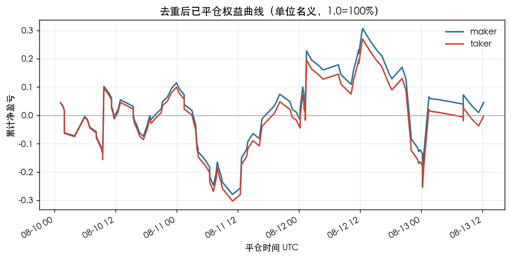
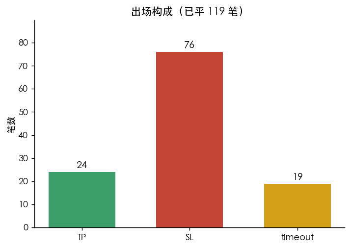
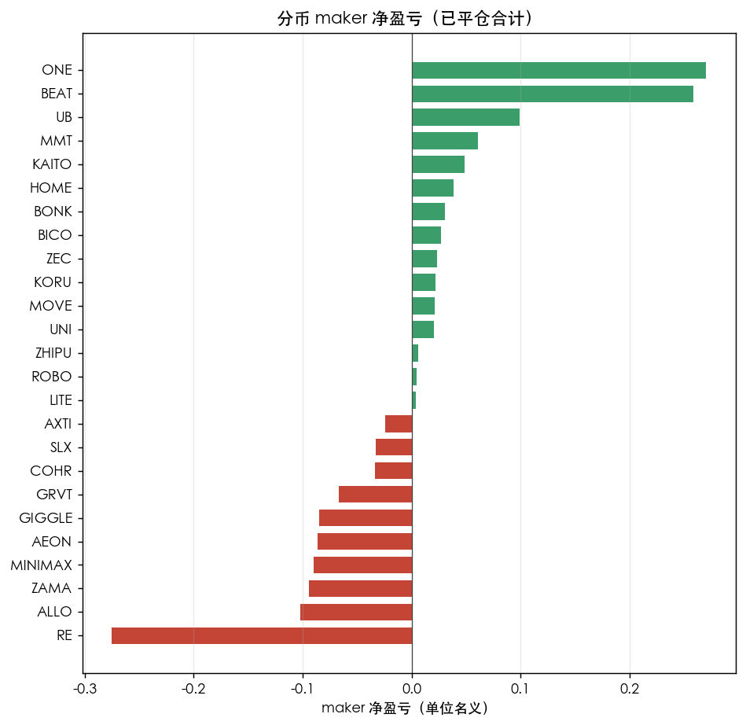
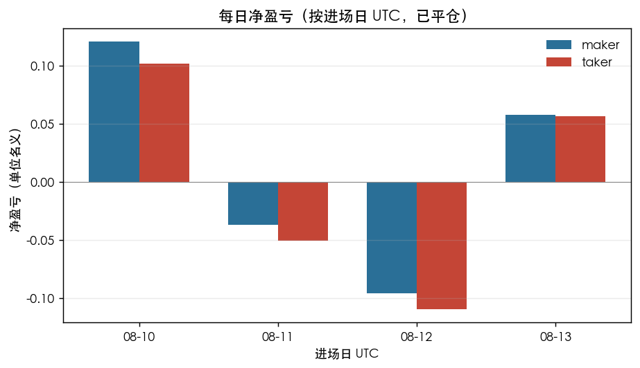

# W10 分类 3 天 holdout 试跑

**仅 3 天 holdout 试跑，不能当验收。未 promote、未下单。**

本配置 `fixed_w10_core4_confirm1_v1_cls` **第 1 次消耗 holdout**（Owner 2026-08-13 明确点名用最近 3 天）。全局 HANDOFF 最后编号是第 12 次误耗，此后还有按配置记账的 2d/3d/ETH 年形态，没有扩成全市场 holdout。

## 怎么回测

1. 每个 15m 决策 bar 只看当时及以前的 10 根：槽 0–4 前文、5–8 核、第 9 根 confirm。没有第 10 根未来 K。
2. `render_w10 overlay=False`，白边 letterbox 到 960，无 CenterCrop、无 ImageNet normalize（与训练一致）。
3. p(SIGNAL)≥0.50 → 按冻结 SHORT 合同下一根开盘做空，TP5×ATR14 / SL2×ATR14 / 72 根，同 bar 双触判 SL。NO_SIGNAL 不做。
4. 同币信号间隔 18 根（现有 MIN_GAP）。不改障碍、不改成本。

## 用了哪份 3 天数据

canonical `~/fable-trading/data/kline_fetched` 的 USDT-SWAP 15m **mtime 停在 2026-08-05**，没有这 3 天。

实际用的是今天刚拉的 disposable 快照：

`~/fable-trading/analysis/output/yoyo_r3a_v3gold_ft_r1_holdout_losers3d_20260813/kline_snapshot/`

- 拉取时间：2026-08-13 12:26 UTC，未写回 canonical
- 26 个当时有数据的 OKX USDT-SWAP（R3A losers 清单，不是全市场）
- 决策区间 UTC：**2026-08-10 00:00 → 2026-08-13 12:00**
- 快照最晚 bar：2026-08-13 12:00 UTC
- 币：AEON, ALLO, AXTI, BEAT, BICO, BONK, COHR, DOS, GIGGLE, GRVT, HOME, KAITO, KORU, LITE, MINIMAX, MMT, MOVE, ONE, RE, ROBO, SLX, UB, UNI, ZAMA, ZEC, ZHIPU（均为 `_USDT_SWAP`）
- DOS 历史较短，只扫到 49 个窗口；其余各 337 个

权重 SHA256 `18bcb5988e6dd36bdf2fc8a1a22d3ad66ab78b777a1d02c88080c937e98d0541`（从 3060 拷回后核对）。推理在 Mac MPS，约 3.4 分钟，未 CPU 硬跑。

## 结果

扫描 8,474 个因果 W10 窗口。

| 口径 | 信号条数 | 已平仓 | 未平仓 | maker 净盈亏 | taker 净盈亏 | maker 胜率 | 出场 |
|---|---:|---:|---:|---:|---:|---:|---|
| **去重后（主口径）** | **126** | **119** | 7 | **+0.0453**（约 +3.8 bp/笔） | **−0.0023**（约 −0.2 bp/笔） | **31.9%** | TP 24 / SL 76 / timeout 19 |
| 未去重 | 938 | 877 | 61 | +4.70 | +4.35 | 40.4% | 同一密集段会重复进场，不当成交 |

净盈亏是每笔单位名义收益之和（1.0 = 100%），maker 成本 6 bp、taker 10 bp 往返。快照在 08-13 12:00 截断，靠近末端的 7 笔未走完 72 根，不计入已平仓。

## 图（去重后已平 119 笔）

## 结论

去重后 119 笔已平仓：maker 勉强略正、taker 打平偏负，胜率 32%，SL 远多于 TP。样本是 3 天 × 26 个 losers 币，不是全市场，也不是 train 之后的独立验收窗。

同一快照上旧 R3A YOLO（W12–19）去重事件 191（间隔 5 根），本分类器 126（间隔 18 根）。进场语义不同，那边这次扫描也没有同一套 SHORT 净盈亏，**不能直接比划算不划算**。

**不能当验收，不能 promote。** 下一步若要可比：同一快照、同一 18 根间隔、同一 TP5/SL2/72 再跑旧 YOLO；或 Owner 另批全市场 3 天。

## 详细分析

数字全部来自已跑完的文件，未重跑回测。主文件：`reports/fixed_w10_core4_confirm1_v1/holdout3d_backtest.json`（与 `~/fable-trading/analysis/output/fixed_w10_cls_holdout3d_20260813/summary.json` 同文）、成交 `signals_dedup.jsonl`（126 行）、对照 `signals_raw.jsonl` / `predictions.jsonl`。交互拆解见 Cursor Canvas `holdout3d-backtest.canvas.tsx`。

### 1. 回测怎么走

配置 `fixed_w10_core4_confirm1_v1_cls`，分类头两类 `NO_SIGNAL` / `SIGNAL`，阈值 0.50，`imgsz=960`，`white_letterbox_full_frame`（无 CenterCrop、无 ImageNet normalize）。

每个 15m 决策 bar 只看当时及以前 **10 根**：槽 0–4 前文、5–8 核、第 9 根 confirm。**没有第 10 根未来 K**。`visible_end_bar` 即决策 bar。

`p(SIGNAL)≥0.50` → 下一根开盘做空（`entry=next_open`）。障碍冻结为 **TP 5×ATR14 / SL 2×ATR14 / 72 根**，同 bar 双触判 SL。`NO_SIGNAL` 不做。同币最小间隔 **18 根**（这 126 笔上 gap 违规 = 0）。成本未改：`yoyo/contracts/costs.py` 的 SWAP maker 往返 6 bp、taker 往返 10 bp；成交记录里 `gross − net_maker = 0.0006`、`gross − net_taker = 0.0010`，对得上。

推理设备 MPS，wall **202.014 s**（约 3.4 分钟）。权重 SHA256 `18bcb5988e6dd36bdf2fc8a1a22d3ad66ab78b777a1d02c88080c937e98d0541`。

### 2. 数据是什么

canonical `~/fable-trading/data/kline_fetched` 的 USDT-SWAP 15m **停在 2026-08-05**，没有这 3 天。实际用 disposable 快照：

`~/fable-trading/analysis/output/yoyo_r3a_v3gold_ft_r1_holdout_losers3d_20260813/kline_snapshot/`

- 拉取 2026-08-13 12:26 UTC，`canonical_data_written: false`
- 决策区间 UTC **2026-08-10 00:00 → 2026-08-13 12:00**（`latest_bar` 同为 12:00）
- **26** 个当时有数据的 OKX USDT-SWAP，来自 CST 08-10/11/12 各日 Top-10 下跌并集（24h quote vol ≥ 5e6），不是全市场
- 币：AEON, ALLO, AXTI, BEAT, BICO, BONK, COHR, DOS, GIGGLE, GRVT, HOME, KAITO, KORU, LITE, MINIMAX, MMT, MOVE, ONE, RE, ROBO, SLX, UB, UNI, ZAMA, ZEC, ZHIPU（均为 `_USDT_SWAP`）
- 窗口：25 币各 337 个 + DOS 49 个 = **8,474**（与 `337×25+49` 一致）
- DOS 从 2026-08-10 12:00 才有 K 线（289 行）；预热后只剩 08-13 00:00–12:00 的 49 窗，**0 个 SIGNAL**
- 本配置 **第 1 次消耗 holdout**（Owner 2026-08-13 点名用最近 3 天）。`production_eligible=false`，`promoted=false`，`orders_placed=false`

预测 8,474 窗里 `SIGNAL` **938**（11.1%），`NO_SIGNAL` 7,536。去重后 126，占窗 1.49%。

### 3. 主口径（去重后）——已用成交文件核对

| 项 | 报告 | `signals_dedup.jsonl` 实算 | 是否一致 |
|---|---:|---:|---|
| 去重信号 | 126 | 126 | 是 |
| 已平 / 未平 | 119 / 7 | 119 closed + 7 open | 是 |
| maker 净盈亏 | +0.0453 | +0.045257 | 是（四位小数） |
| taker 净盈亏 | −0.0023 | −0.002343 | 是 |
| maker 胜率 | 31.9% | 38/119 = 31.9328% | 是 |
| 出场 | TP 24 / SL 76 / timeout 19 | 同；未平 outcome=`running` | 是 |
| 均毛 / 均 maker | +9.80 bp / +3.80 bp | 同 | 是 |

净盈亏是每笔单位名义收益之和（1.0 = 100%）。taker 胜率同样 38/119，没有零收益笔。已平仓覆盖 **25** 个币（缺 DOS）。

未去重 938 笔：已平 877、未平 61，maker +4.70、taker +4.35、胜率 40.4%，出场 SL 494 / TP 205 / timeout 176，另有 raw 独有的 `sl_ambiguous` 2、`no_entry` 2。同一密集段会重复进场，**不当成交**。raw/dedup ≈ 7.44。

### 4. 为什么胜率低也可能小赚——以及本样本实际靠什么

合同是 5:2。不计成本盈亏平衡胜率 = 2/(5+2) ≈ **28.6%**。已平 119 笔 maker 胜率 31.9%，看起来刚跨过这条线，总 maker **+0.0453**。

实现均值也对得上 5:2：TP 均毛 **+6.55%**（均 ATR% 1.31%，5×ATR ≈ 6.56%），SL 均毛 **−2.54%**（均 ATR% 1.27%，2×ATR ≈ 2.54%），比约 **2.59**。

但拆开看出场，5:2 **没有单独把账做正**：

| 出场 | 笔数 | 占已平 | 均毛 | 合计 maker | maker>0 | 均持仓根 | 均 p |
|---|---:|---:|---:|---:|---:|---:|---:|
| TP | 24 | 20.2% | +0.0655 | **+1.5585** | 24/24 | 24.5 | 0.597 |
| SL | 76 | 63.9% | −0.0254 | **−1.9724** | 0/76 | 16.5 | 0.600 |
| timeout | 19 | 16.0% | +0.0248 | **+0.4591** | 14/19 | 72 | 0.613 |
| 已平合计 | 119 | 100% | +0.0098 | **+0.0453** | 38/119 | 27.0 | 0.601 |

- 只算 TP+SL（100 笔）：maker **−0.4139**。这 100 笔里 TP 占比 **24.0%**，低于 28.6%。
- timeout 19 笔均毛只有 **+2.48%**（约 1.6×ATR，不是 5R），14 赢 5 亏，合计 **+0.4591**，把总账从 −0.41 拉到 +0.045。
- 31.9% 胜率 = 24 笔 TP + **14 笔 timeout 赢**，不是 38 笔都打到 5R。
- taker 往返 10 bp 后合计 **−0.0023**，打平偏负。

结论：5:2 的实现比例成立，但本样本打到 TP 的比例不够；小赚主要靠 72 根到期时价格仍偏有利。timeout 不能外推成稳定的 5R。SL 中位持仓 10 根，亏得比 TP 更快。BEAT 有一笔 SL 毛 **−19.71%**（进场 08-12 13:00），远超 2×ATR，属于大阴线穿透。

### 5. 按日、按币、分数桶

按**进场日 UTC**（去重后）：

| 进场日 | 信号 | 已平 | 未平 | TP | SL | timeout | maker | taker | 胜率 |
|---|---:|---:|---:|---:|---:|---:|---:|---:|---:|
| 2026-08-10 | 48 | 48 | 0 | 9 | 30 | 9 | +0.1208 | +0.1016 | 17/48 = 35.4% |
| 2026-08-11 | 34 | 34 | 0 | 7 | 21 | 6 | −0.0371 | −0.0507 | 11/34 = 32.4% |
| 2026-08-12 | 35 | 34 | 1 | 6 | 24 | 4 | −0.0959 | −0.1095 | 8/34 = 23.5% |
| 2026-08-13（至 12:00） | 9 | 3 | 6 | 2 | 1 | 0 | +0.0576 | +0.0564 | 2/3 |

08-10 赚的、08-11/12 吐回。08-13 已平只有 3 笔（UB TP、COHR TP、KORU SL），6 笔未平，不能当完整交易日。COHR 这笔 TP 的 `exit_time` 为 12:15，与 `latest_bar` 12:00 差一根；等于进场 07:15 + 20×15m 的时钟加法，最后一根可见 K 仍是 12:00。

按币种 maker（已平合计，四位小数；胜率按 maker>0）。15 个币合计 **+0.9349**，10 个币合计 **−0.8897**。前三 ONE+BEAT+UB = **+0.6275**，已经大于全体 +0.0453。

| 币 | 去重 | 已平 | 未平 | TP | SL | timeout | maker | 胜率 |
|---|---:|---:|---:|---:|---:|---:|---:|---:|
| ONE | 5 | 5 | 0 | 3 | 1 | 1 | +0.2702 | 80.0% |
| BEAT | 3 | 3 | 0 | 2 | 1 | 0 | +0.2585 | 66.7% |
| UB | 6 | 6 | 0 | 3 | 3 | 0 | +0.0989 | 50.0% |
| MMT | 6 | 6 | 0 | 1 | 3 | 2 | +0.0609 | 50.0% |
| KAITO | 5 | 5 | 0 | 2 | 2 | 1 | +0.0488 | 60.0% |
| HOME | 2 | 2 | 0 | 0 | 1 | 1 | +0.0383 | 50.0% |
| BONK | 6 | 6 | 0 | 2 | 3 | 1 | +0.0308 | 50.0% |
| BICO | 2 | 2 | 0 | 0 | 1 | 1 | +0.0270 | 50.0% |
| ZEC | 1 | 1 | 0 | 1 | 0 | 0 | +0.0230 | 100% |
| KORU | 2 | 2 | 0 | 1 | 1 | 0 | +0.0218 | 50.0% |
| MOVE | 4 | 2 | 2 | 1 | 1 | 0 | +0.0213 | 50.0% |
| UNI | 7 | 6 | 1 | 2 | 2 | 2 | +0.0207 | 33.3% |
| ZHIPU | 3 | 3 | 0 | 1 | 1 | 1 | +0.0063 | 33.3% |
| ROBO | 7 | 7 | 0 | 1 | 4 | 2 | +0.0048 | 42.9% |
| LITE | 3 | 3 | 0 | 0 | 2 | 1 | +0.0037 | 33.3% |
| DOS | 0 | 0 | 0 | 0 | 0 | 0 | 0 | — |
| AXTI | 4 | 3 | 1 | 1 | 2 | 0 | −0.0239 | 33.3% |
| SLX | 6 | 6 | 0 | 0 | 4 | 2 | −0.0329 | 33.3% |
| COHR | 5 | 4 | 1 | 1 | 3 | 0 | −0.0336 | 25.0% |
| GRVT | 6 | 6 | 0 | 1 | 4 | 1 | −0.0669 | 16.7% |
| GIGGLE | 7 | 6 | 1 | 0 | 5 | 1 | −0.0852 | 16.7% |
| AEON | 5 | 5 | 0 | 0 | 4 | 1 | −0.0860 | 20.0% |
| MINIMAX | 4 | 4 | 0 | 0 | 3 | 1 | −0.0896 | 0% |
| ZAMA | 6 | 6 | 0 | 0 | 6 | 0 | −0.0942 | 0% |
| ALLO | 9 | 8 | 1 | 1 | 7 | 0 | −0.1024 | 12.5% |
| RE | 12 | 12 | 0 | 0 | 12 | 0 | −0.2750 | 0% |

最大赢：BEAT 08-10 01:15 TP 毛 +0.2535；ONE 08-12 01:15 TP 毛 +0.2143（持仓 1 根）；BEAT 08-12 23:45 TP 毛 +0.2039。最大亏：BEAT 08-12 13:00 SL 毛 −0.1971。

p(SIGNAL) 已平分桶（去重 p 最低 0.5011、最高 0.7308，没有 ≥0.80）：

| p | 已平 | 胜率 | maker | TP/SL/timeout |
|---|---:|---:|---:|---|
| 0.50–0.55 | 37 | 35.1% | +0.2506 | 7/23/7 |
| 0.55–0.60 | 29 | 31.0% | +0.0778 | 7/20/2 |
| 0.60–0.70 | 37 | 35.1% | −0.1131 | 9/21/7 |
| 0.70–0.80 | 16 | 18.8% | −0.1701 | 1/12/3 |

本样本分数更高没有更赚。赢/亏两笔均 p 几乎一样（0.599 vs 0.603）。不能据此调阈值，n 太小。

### 6. 未平仓 7 笔

不计入已平盈亏。持有根数按快照 12:00 与进场时间相减：

| 币 | 进场 UTC | p | ATR% | 已持有 | 约剩 |
|---|---|---:|---:|---:|---:|
| ALLO | 08-12 18:30 | 0.593 | 1.75% | 70 | 2 |
| COHR | 08-13 00:45 | 0.627 | 1.37% | 45 | 27 |
| MOVE | 08-13 04:00 | 0.533 | 1.91% | 32 | 40 |
| GIGGLE | 08-13 06:15 | 0.512 | 0.99% | 23 | 49 |
| AXTI | 08-13 07:15 | 0.698 | 0.80% | 19 | 53 |
| MOVE | 08-13 08:30 | 0.563 | 1.10% | 14 | 58 |
| UNI | 08-13 11:30 | 0.655 | 0.48% | 2 | 70 |

ALLO 再 2 根就到 72 根超时，截断对总账不是零影响，只是这 7 笔现在没有记盈亏。

### 7. 混淆 / 漏报：没有

这 3 天快照没有人工金标，`predictions.jsonl` 只有模型自己的 `pred` / `p_signal`，**算不出混淆矩阵，也没有漏报率**。不得用训练 val top1 **91.4%** 冒充回测——那是 epoch 3 的分类 val，test 没跑，与这 119 笔 SHORT 盈亏不是同一件事。

### 8. 样本偏差

losers 清单（CST 完整日 08-10/11/12 Top-10 并集，见 `daily_loser_boards.csv`）：

- 08-10：BEAT −37.3%、AXTI −16.2%、COHR −13.7%、LITE、SLX、AEON、ZEC、KAITO、MINIMAX、KORU
- 08-11：BEAT −54.2%、HOME −26.6%、GRVT、ROBO、MOVE、BICO、ZHIPU、ALLO、RE、BONK
- 08-12：ONE −40.4%、KAITO −30.1%、DOS −23.6%、BICO、MMT、GIGGLE、UB、ROBO、UNI、ZAMA

做空这批币，天然偏向「已经在跌」。ONE/BEAT 的大 TP 和 BEAT 的大 SL 都发生在这种暴跌样本里。3.5 个日历日、未平 7 笔、盈亏集中在两三个币，统计不稳定。08-13 的未完成日榜含 CRV/2Z，**不在**这 26 币快照里。

### 9. 为什么不能跟旧 YOLO 直接比

同快照上 `yoyo_r3a_v3gold_ft_r1` 扫描（`scan/scan_summary.json`）：W12–19 center-crop，conf 0.25，间隔 **5** 根，去重事件 **191**，raw 3,754，耗时 2,908 s。**没有**同一套 TP5/SL2/72 的 SHORT 净盈亏。

两边窗口不同（检测框 vs W10 分类）、任务不同、间隔 5 vs 18、阈值不同。191 vs 126 只能说明「各扫出多少事件」，不能比划算不划算。

### 10. 不能当验收、不能上实盘

`not_acceptance: true`，`production_eligible: false`，`promoted: false`，`orders_placed: false`。holdout 只许最终验收、每次消耗要记账；这是本配置第 1 次、且只是 losers×3 天试跑，不是全市场 holdout 验收。未 promote、未下单。

成交级 126 行在 `signals_dedup.jsonl`（字段：`symbol, entry_time, p_signal, outcome, gross_ret, net_maker, net_taker, exit_offset, exit_time, status`）。下文不重复贴全部 126 行，Canvas 里可按 TP/SL/timeout/未平筛选。
